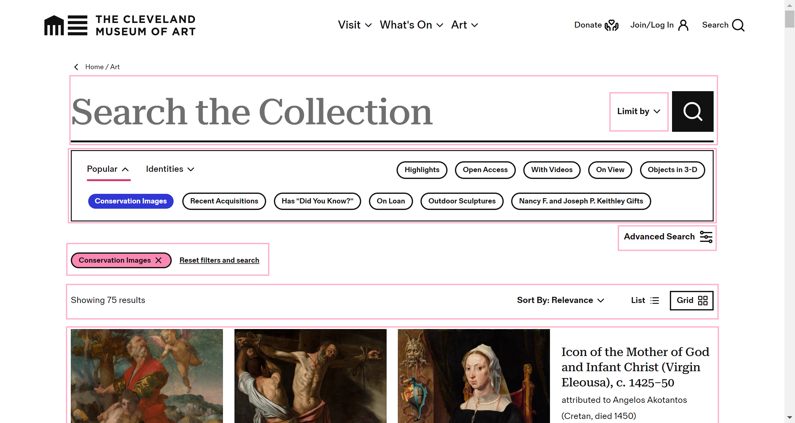

# 第三次会议

## 会议信息

- 会议时间：2025年5月3日 21:30
- 主持人：杨蕊菡
- 参会人员：陈嘉欣、梅宸倩、杨心怡、崔文悦、高洁
- 会议记录员：杨蕊菡
- 会议地点：腾讯会议线上

## 计划会议内容

- 统一页面风格
- 各成员分享各自的代码编写、文档撰写进度

## 讨论成果

**页面风格：**

色调主题：黑白

- 仿照`clevelandart`博物馆风格开发文物主页和详情页：包括风格和布局

  

- 使用`timeline.js`和`d3.js`库完成时间线和知识图谱可视化

  - 技术路线：首先阅读库的说明文档，学习两种库的使用方法，必要时参考AI代码

- 登陆注册使用el-plus卡片样式完成（黑白配色，基于`clevelandart`博物馆主页风格）

  - 可添加用户实时动态交互，增加用户使用体验，优化使用感受

- 用户界面使用传统侧栏、标签页布局

**进度跟进：**

- 目前已完成知识图谱、时间线、登陆注册的后端逻辑和大体框架搭建。

- 文档组已完成需求文档、设计文档初步撰写
